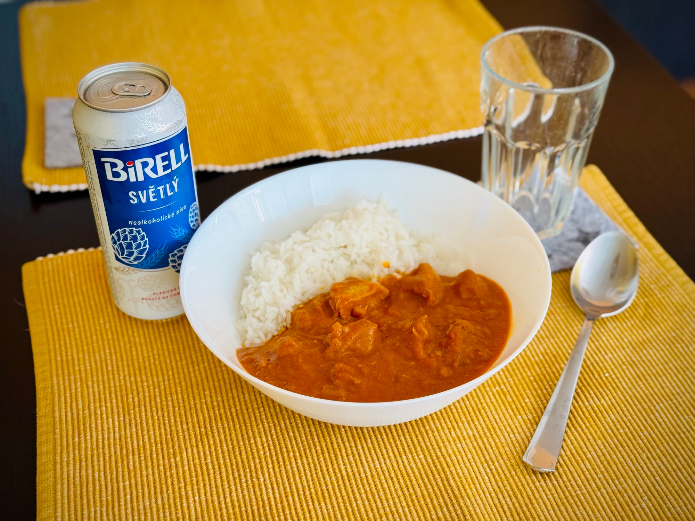

## Ingredience
  
* kuřecí maso 500 g
* bílá cibule 1 ks
* česnek 2 stroužky
* zázvor (nastrouhaný) 1 lžíce
* krájená rajčata 400 g (1 plechovka)
* římský kmín 1 lžička
* kurkuma 2 lžičky
* koření garam másala 1 lžička
* kardamom (mletý) 1 lžička
* mletá skořice 1 špetka
* máslo 5 lžic
* smetana ke šlehání 150 ml
* koriandr (čerstvý)
* kajenský pepř 1 špetka

### Postup

**Maso nakrájíme** na větší kousky. Přidáme **lžičku kurkumi a kajenského pepře** (pokud nechceme pálivé, vynecháme). Necháme cca 15 minut odležet.

Rozehřejeme lžíci másla na pánvi a **osmahneme na něm maso** ze všech stran dozlatova. Maso dáme stranou.

Přdáme další lžíci másla a **osmažíme cibuli dozlatova**.

Přidáme **česnek a zázvor**, které také krátce osmahneme.

**Přidejte koření** římský kmín, kurkumu, garam másala, kardamom a skořici. Krátce zarestujte.

Do pánve **přidáme krájená rajčata** a vaříme asi 10 minut, dokud směs nezhoustne.

Nakonec přilijte asi **150 ml smetany ke šlehání**.

Vše vařte cca 15-20 minut, dokud není maso měkké.

Butter chicken podávejte s bílou rýží posypané čerstvým koriandrem.

 