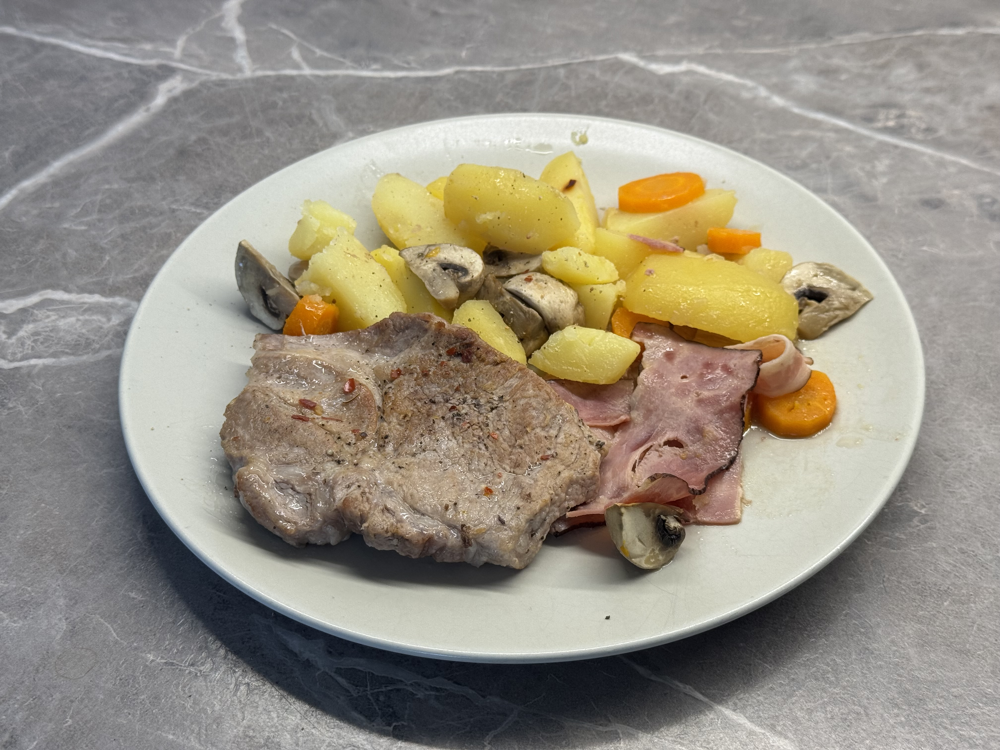

#### Ingredience (na cca 4 porce):

- 4 plátky vepřové krkovice (lze použít i kotletu s kostí)
- Slanina (špek, schwarzwaldská šunka nebo anglická slanina), dle chuti
- 4–5 brambor, nakrájených na plátky nebo půlkolečka
- 1–2 cibule, nakrájené nahrubo
- Zelenina dle chuti: mrkev, cuketa, žampiony, česnek, paprika
- Bylinky (např. majoránka, tymián, rozmarýn)
- Trocha oleje (např. olivového)
- Hořčice (plnotučná, volitelně)
- Koření: sůl, pepř, chilli – dle chuti

#### Postup

1. Předehřej troubu na **180–200 °C** a nachystej si hluboký plech.
2. Maso potřete olejem, osolte a opepřete. Poté ho **zprudka opečte** 2 minuty z každé strany.
3. Připrav si dostatečně velký kříž z alobalu, aby se do něj vešly brambory, zelenina i maso.
4. Na úplný spodek polož slaninu/šunku/špek.
5. Na slaninu navrstvi brambory (měsíčky nebo kolečka).
6. Přidej další zeleninu podle chuti (mrkev, cuketu, žampiony, česnek, papriku).
7. Vše osol, opepři a ochuť bylinkami.
8. Nahoru dej opečený plátek masa. Můžeš ho nechat jen tak, nebo ho **potřít hořčicí**.
9. Pokud máš, zalij šťávou z masa.
10. Balíček **pořádně** a hermeticky zabal, aby neunikala pára.

:::tip[Pečení]
Peč přibližně **60 minut při 180–200 °C**.
:::

