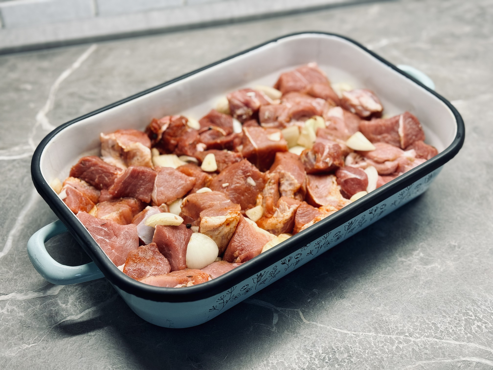
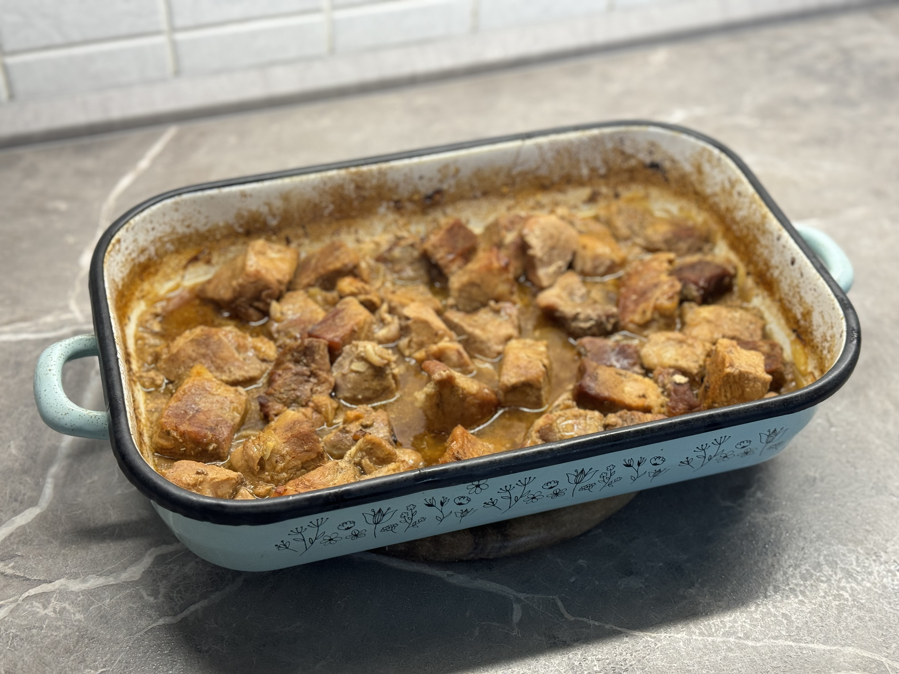

### Vypřové výpečky

- 600 g veprvového masa (vepřová plec nebo krkovice)
- 1 střední cibule
- mletý kmín
- pepř kuličky
- mletá paprika (volitelně
- stroužek česneku

#### Příprava výpečků

1. Maso nakrájíme na větší kostky a osolíme (na cca 1% tedy 6g soli na 600 g masa).
2. Cibuli nakrájíme na hrubo (větší kousky 3-4 cm).
3. Česnek nakrájíme na plátky, nebo ponecháme celý.
4. Vše promícháme, přidáme drcený kmín a kuličky pepře.
5. Podlejeme cca 100ml vody nebo piva.

:::tip[Pečení]
Pečeme na 160°C - 180°C zhruba dvě hodiny.
:::

Maso během pečení kontrolujeme, ale ne moc často. Občas promíchejte.
Podléváme podle potřeby - ideálně vařící vodou. Nejprve pečeme maso pod 
poklicí nebo alobalem. Poté odkryjeme a pečte další půlhodinu, 
aby se maso opeklo dozlatova.

### Zelí

- 1 hlávka zelí
- 1 střední cibule
- 1 lžíce cukru
- 1 lžíce octa
- 1 lžíce oleje
- sůl
- kmín
- pepř
- bobkový list

Do hrnce dáme na oleji osmahnout cibuli, přidáme na nudličky nakrájené zelí. 
Zelí je dobré předem vymačkat a nasolit. Přidáme cukr, sůl, kmín, pepř, bobkový list a ocet.