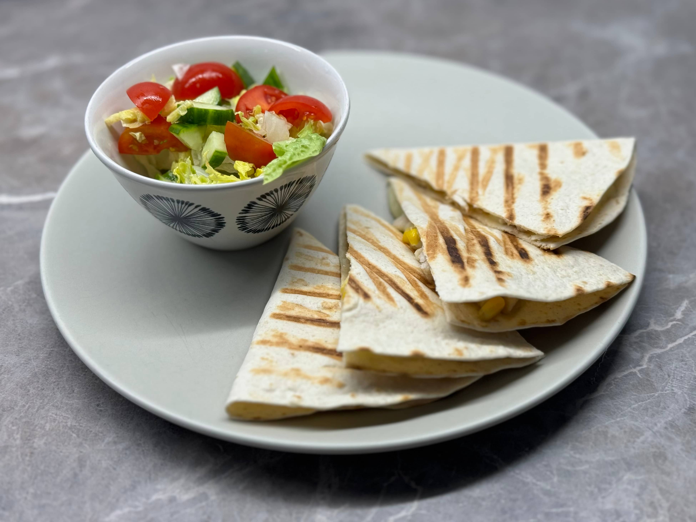

## Ingredience

- 500 g kuřecího masa
- 200 g strouhaného sýra (mozzarella, cheddar nebo jiný)
- kukuřice (1 plechovka nebo 200 g)
- 6 tortilly

Maso nakrájíme na malé kousky (1x1 cm) a osmahneme na pánvi s trochou oleje - můžeme přidat i cibuli a koření podle
chuti (např. paprika, sůl, pepř). Nastrouháme sýr - tortilly naplníme masem, sýrem a kukuřicí, přehneme na polovinu a
opékáme na pánvi nebo grilu.
