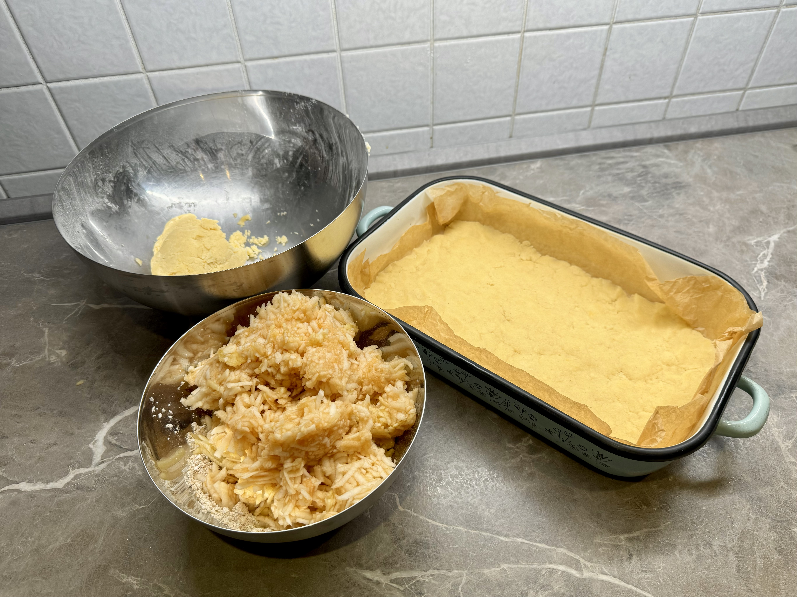
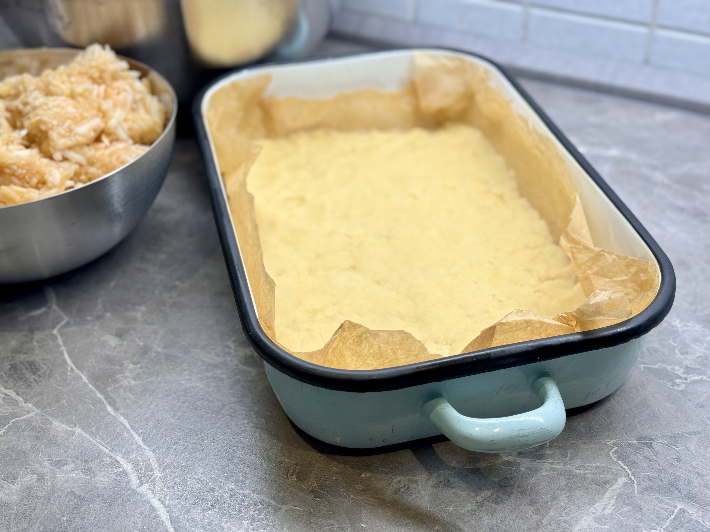
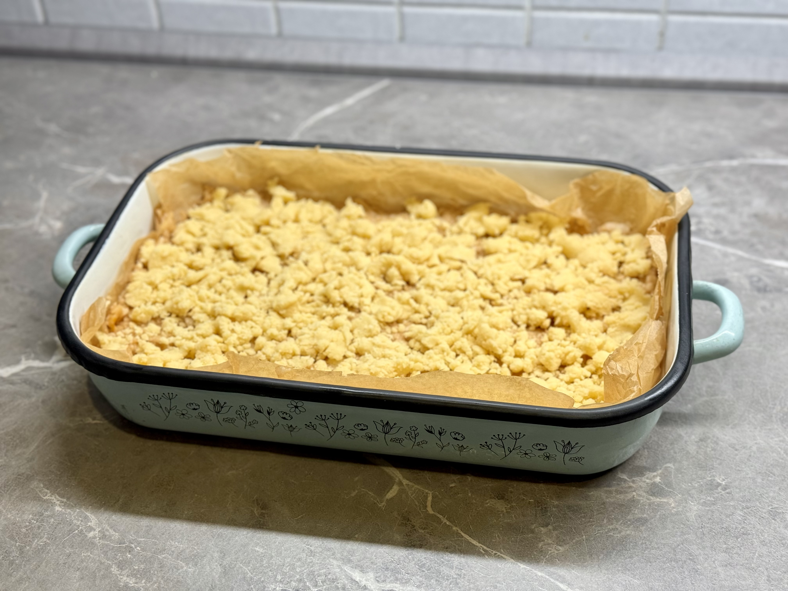
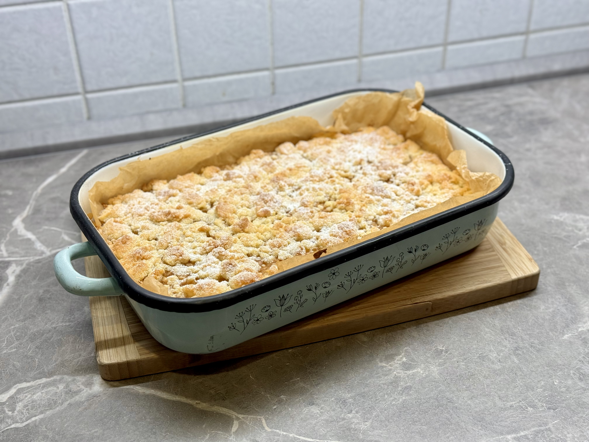
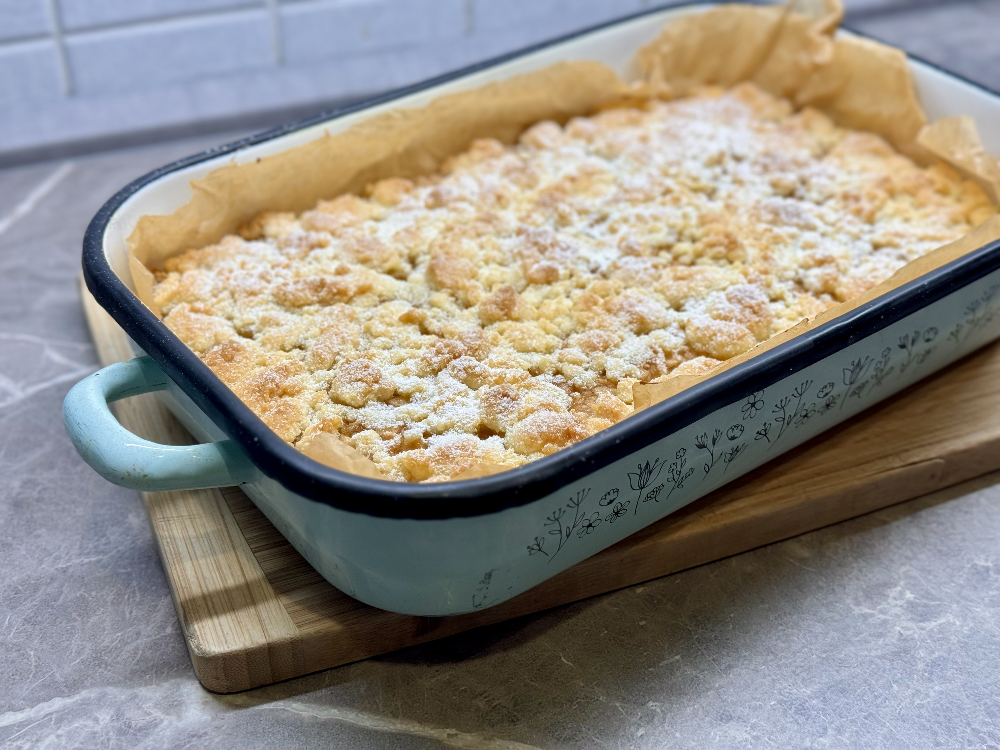

Těsto:

- 400 g polohrubé mouky
- 3/4 balíčku prášku do pečiva
- 150 g cukr krupice
- 1 vanilkový cukr
- 1 vejce
- 200 g másla

Jablečná náplň:

- cca 1 kg jablek
- 1 pudinkový prášek vanilkový
- 1/2 lžíce skořice
- 120 g cukr krupice (dle chuti a sladkosti jablek)

Postup:

1. Oloupané a nastrouhané jablka smícháme s pudinkem, skořicí a cukrem.
2. V míse smícháme mouku s práškem do pečiva, cukrem a vanilkovým cukrem.
3. Přidáme vejce a na kostičky nakrájené máslo. Vypracujeme těsto.
4. Těsto **rozdělíme na dvě části**. První část těsta použijeme na spodek, druhou na drobenku.
5. Vyšší pekáček o rozměrech cca 35×30 cm vyložíme pečicím papírem.
6. Polovinu drobenky **nasypeme do pekáčku**, uhladíme do rovnoměrné vrstvy.
7. Na drobenku rozprostřeme jablkovou náplň.
8. Na jablka nasypeme druhou polovinu drobenky.

:::tip[Pečení]
Pečeme na 170°C cca 35-40 minut, dokud povrch nezezlátne.
:::

Příprava koláče: 

Před pečením: 

Hotový koláč: 

