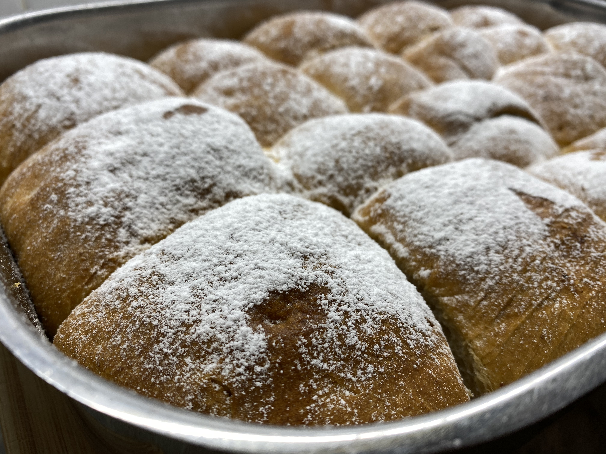

- 400 g hladké mouky + 100 g špaldové mouky
- 1/2 lžičky (opravdu velká špetka) soli
- 100 g másla rozpuštěného
- 2 žloutky
- 1 vanilkový cukr
- citronová kůra
- 30 g čerstvého droždí
- 250 ml vlažného mléka
- 90 g krupicového cukru
- 50-75 g rozpuštěného másla na pomazání buchet a pekáče

### Tvarohová náplň

- 500 g tvrhého tvarohu + klasický tvaroh (ne z vaničky)
- hrst opraných rozinek, mohou být namočené v Rumu
- 1-2 vejce podle hustoty tvarohu
- 3 lžíce cukru
- 1 vanilkový cukr

### Postup

1. Ohřejte mléko, aby bylo vlažné - přidejte droždí a cukr, nechejte vzejít
   (10 - 15 min).
2. Promíchejte prosetou mouku, vanilkový cukr, sůl a citronovou kůru.
3. Přidejte žloutky, rozpuštěné máslo a vzejité droždí s mlékem.
4. Zpracujte těsto a nechte v teplém místě kynout 1-2 hodiny - po hodině vždy
   znovu promíchat.
5. Vykynuté těsto podsypeme a vyválíme na válu na cca 1cm tloušťku.
6. Vykrajujeme čtverce o velikosti 6x6 cm
7. Čtverce plníme náplňí a klademe uzlíkem dolů do máslem vymazaného pekáče
   (30x40 cm) vedle sebe.
8. Buchty je potřeba pořádně potřít máslem a nechat ještě 15-20 min kynout
9. Zapneme troubu a necháme předehřát na 180 °C peřeme prudce 10 minut, porté
   snížíme teplotu na 150-160 °C a pozvólna dopékáme 40-50 minut

