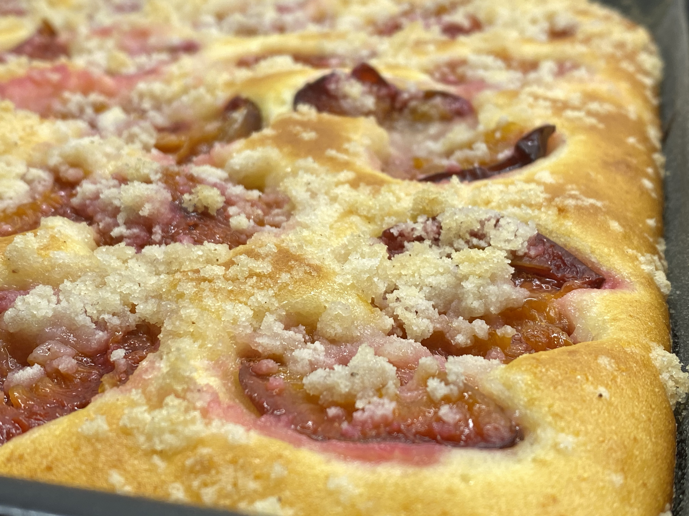
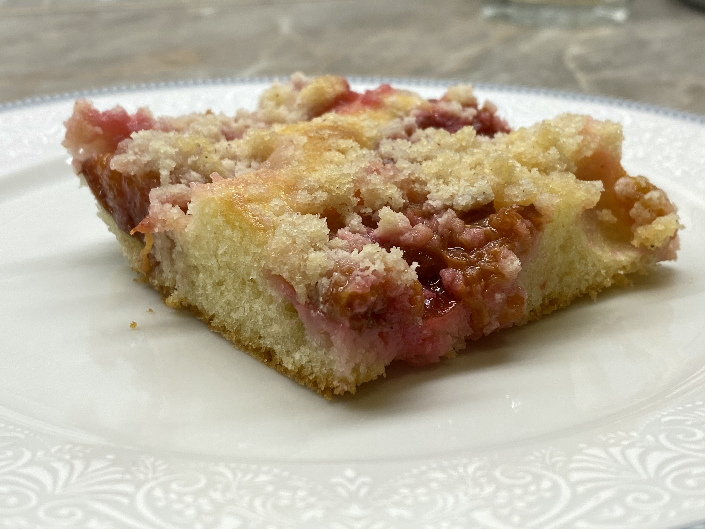

Promícháme nejprve sypkou část:

- 1 hrnek polohrubé mouka
- 1 hrnek hladké mouky (nebo špaldové)
- 1 balíček prášek do pečiva
- 3/4 hrnečku cukr moučka
- vanilkový cukr
- citronová kůra

Poté samostatně promícháme tekutou část:

- 1x hrnek mléka
- 1/2 hrnku oleje nebo rozpuštěného másla
- 1 ks vejce
- špetka soli

Následně vše smícháme dohromady a vylejeme na vymazaný plech. Pokladame ovoce a posypeme posypkou z másla, hrubé mouky,
hnědého cukru.

:::tip[Pečení]
Pečeme cca 20 - 30 minut na 180 °C
:::

