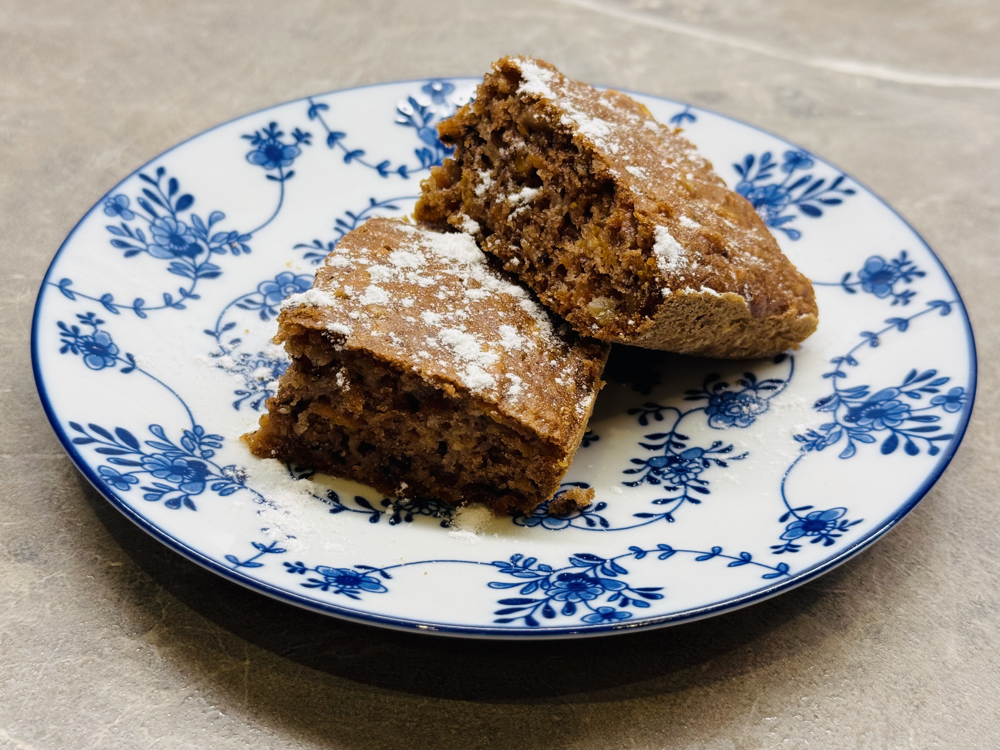

#### Suroviny

Promícháme **sypké suroviny**:

* 1,5 hrnku polohrubé mouky
* 1/2 hrnku moučkového cukru
* 1 balení kypřicího prášku
* 1 balení vanilkového cukru

dále promícháme **tekuté suroviny**:

* 2 vejce
* 1/2 hrnku oleje (řepkový nebo slunečnicový)
* 1/2 hrnku polotučného mléka
* 1 lžička jedlé sody
* 1 lžička kakaa
* 1 lžička mleté skořice
* špetka soli

dále budeme potřebovat:

* 1 hrnek nahrubo nastrouhané mrkve (tři větší mrkve)
* 1/2 hrnku nahrubo nastrouhaného jablka se slupkou (jedno velké jablko)
* 1 hrnek (100g) nasekaných vlašských ořechů

#### Postup

Nejprve si nasekejte/namelte ořechy. Poté na hrubém struhadle nastrouhejte mrkev a jablko.
Promíchejte nejprve **sypké suroviny**, poté promíchejte **tekuté suroviny** a nakonec přidejte ořechy, mrkev a jablka.
Těsto vylejte do máslem vymazaného a moukou vysypaného plechu a pečte na 180 °C cca 35 minut.

:::tip[Pečení]
Pečeme na cca 180 °C cca. 35 minut.
:::

