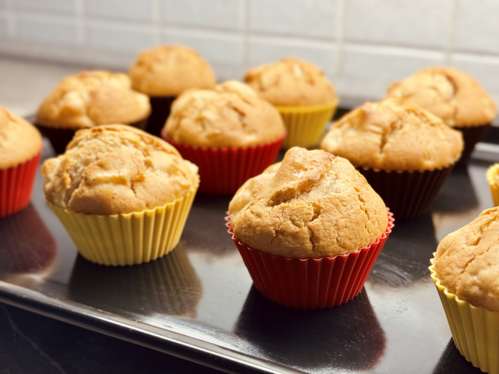
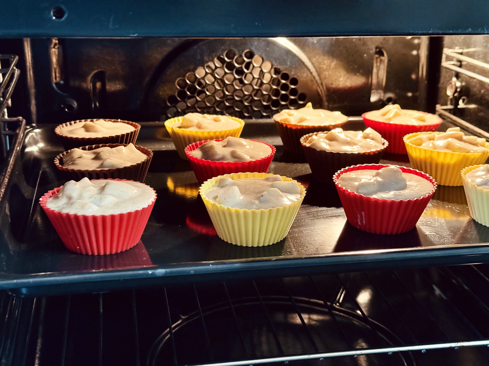

Nejprve smícháme tekuté ingredience:

- 100 ml mléka
- 100 ml oleje
- půl hrnku cukru
- vanilkový cukr
- lžička mleté skořice
- vajíčko

Poté zvlášť smícháme sypké ingredience:

- 1,5 hrnku hladké mouky
- prášek do pečiva

Oloupeme si dvě větší jablka a nakrájíme je na kostičky (1x1 cm).

Promícháme tekuté a sypké ingredience. Podle potřeby přidáme buď mouku nebo mléko. Nakonec přidáme jablka. Vzniklé těsto
by němelo být příliš řídké.

Naplníme formičky na muffiny a pečeme.

:::tip[Pečení]
Pečeme na 180°C zhruba 25 minut
:::

