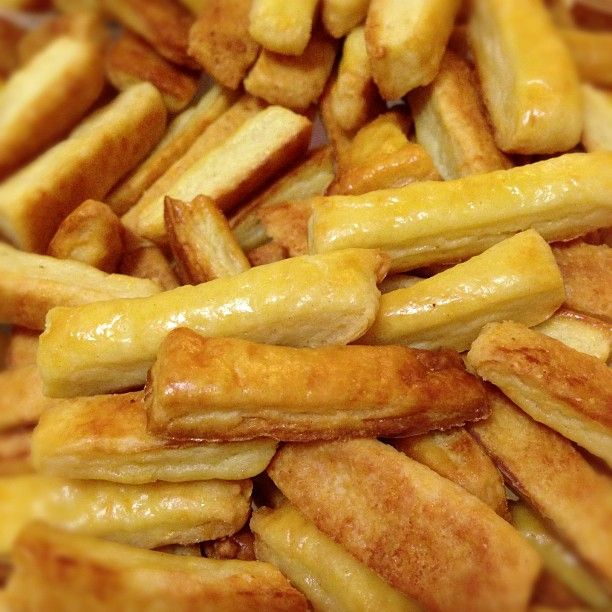

## Co budete potřebovat?

Suroviny na 1 dávku (která vám stejně nebude stačit):

- 160 g hladké mouky
- 100 g Hery nebo másla
- 100 g jemně strouhaného sýra (Eidam, Gran Moravia, Provolone piccante)
- 10 g droždí (¼ kostky)
- 4 lžíce mléka
- žloutek na potření

## Postup

Těsto se nenechává kynout! Rovnou se vyvaluje na cca 3 mm a krájí na tyčinky (5 až 7 krát 1 cm tyčinky). Nakrájené
tyčinky klademe na plech a potíráme rozšlehaným vejcem (kvůli lesku). Klademe vedle sebe na plech na pečící papír. Před
pečením osolíme tyčinky hrubou solí.

:::tip[Pečení]
Pečeme na 120°C cca 12 minut do růžova.
:::

