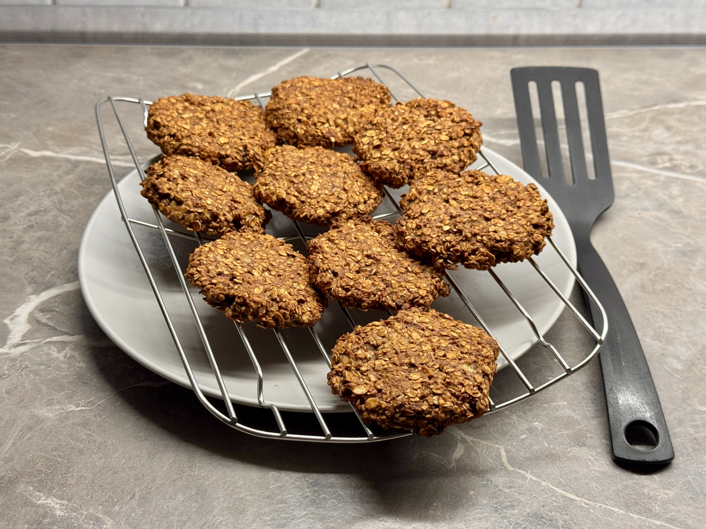

- ovesné vločky (dle potřeby cca hrnek)
- 4 lžíce hladké mouky
- 2 lžíce medu
- 20 g másla
- špatka soli
- 2 lžičky kakaa
- dva banány
- 1/2 prášku do pečiva
- vanilkový extrakt, skořice, perníkové koření
- volitelné: sekaná čokoláda, oříšky, sušené ovoce, rozinky

1. Smícháme mouku, vločky, prášek do pečiva, koření, kakao a sůl.
2. Rozpustíme máslo a smícháme s medem.
3. Rozmačkáme banány a přidáme k suchým ingrediencím.

Výsledné těsto by nemělo být příliš tuhé ani příliš řídké. 
Podle potřeby přidáme vločky nebo mouku - přépadně naředíme mlékem.

Těsto můžeme trochu ochutnat, neobsahuje žádné surové vejce, takže je to bezpečné.

Na pečící papír vytvarujeme lžící sušenky a dáme péct.

:::tip[Pečení]
Pečeme v předehřáté troubě na 180 °C cca 20-30 minut, dle tlouštky sušenek.
:::