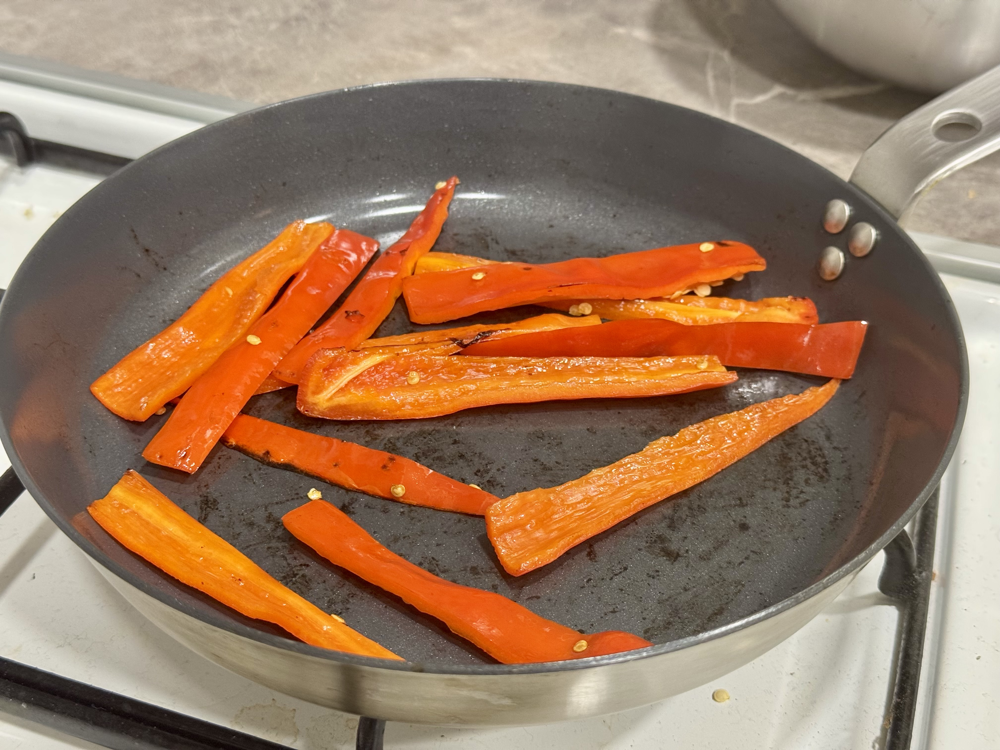
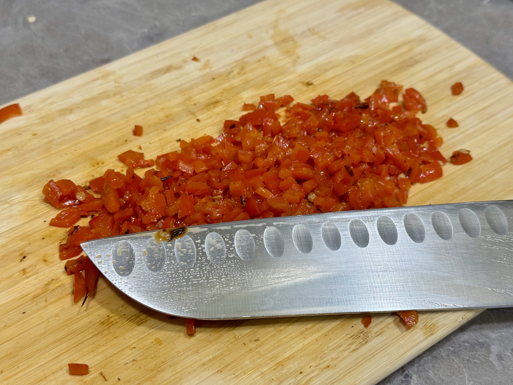
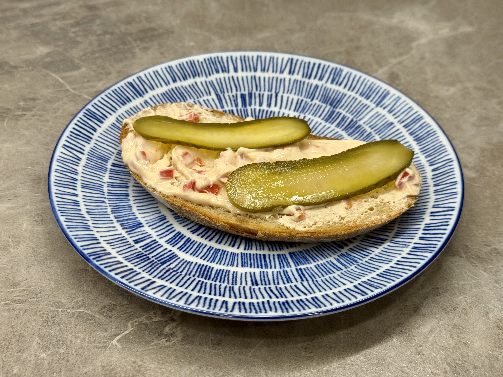

- červená paprika (ne kapie)
- polotučný tvaroh ve vaničce
- 1x lžička mleté sladké papriky
- kousek česneku
- sůl, pepř, chilli dle chuti

Paprika se **nakrájí na plátky** a zprudka opeče na pánvi. Jestli se paprika moc připaluje, přidejte trochu vody nebo oleje.

Po opečení necháme papriku vychladnout a nakrájíme je na malé kousky.

Česnek prolisujeme a smícháme s tvarohem, přidáme mletou papriku, sůl, pepř a chilli dle chuti.

