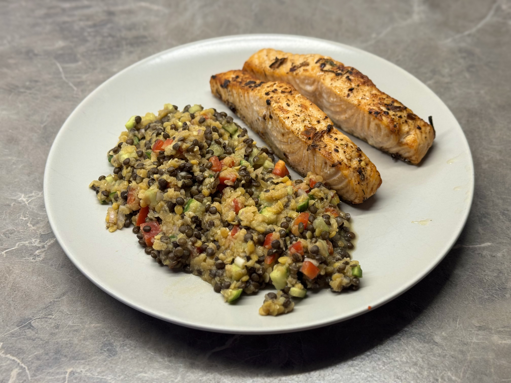

Na jednu porci čočkového salátu potřebujeme:

* 150 g vařené čočky beluga
* 150 g vařené červené čočky
* 50 g červené papriky
* 100 g salátové okurky
* 1 × červená cibule
* limetka (šťáva)
* lžíce krémového balzamica
* extra panenský olivový olej
* 10 × listů čerstvé máty
* pepř
* sůl

Čočku uvaříme dle návodu a necháme vychladnout, papriku a okurku nakrájíme na kostky a cibuli najemno.
Vařenou čočku, papriku, okurku a cibuli smícháme v jedné míse a ochutíme balsamikem, nasekanou mátou, solí, pepřem, šťávou z limetky; nakonec zakápneme olivovým olejem. Podáváme jako samostatné syté jídlo nebo třeba jako přílohu k rybě.

Video: https://www.youtube.com/watch?v=5fXVdvCMVSw

Zdroj: https://kuchynelidlu.cz/recept/cockovy-salat