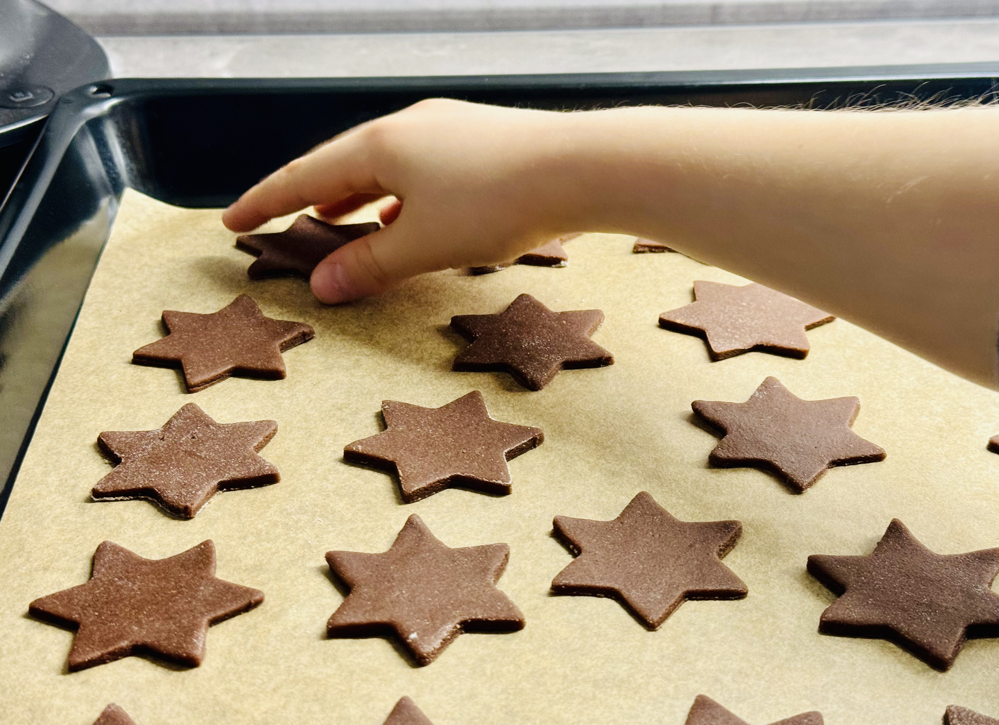

#### Perníkové těsto

- 2 vejce
- 200 - 250 g cukru moučky
- 50 g másla
- 3 lžíce medu - ideální je tmavý lesní med
- 1 lžíce kaka - pokud chcete perníčky tmavší a nebo máte světlý med
- 500 g hladké mouky
- 1 lžičku sody
- Koření - umlít nebo rozdrtit v hmoždíři
  - hřebíček - cca 8 ks
  - fenykl - cca lžičku
  - skořice - cca lžičku
  - badyán - cca 2-3 hvězdičky
  - citronová kůra z ½ citronu

Máslo a med společně rozpustit v teplé vodní lázni za stálého míchání. Těsto se díky tomu pak bude lépe zpracovávat.

Vše pořádně promícháme. Konzistence těsta se odvíjí od použitého medu - pokud je těsto moc suché je možné přidat lžičku
vody nebo trochu medu.

Hotové těsto necháme 24 hodin odpočinou v lednici zabalené v potravinové folii.

Vyvalujeme cca na 3 mm (tlustší těsto = měkké perníčky, tenčí těsto = křupavé a sušší perníčky). 
Od tloušťky těsta se odvíjí i doba pečení.

:::tip[Pečení]
Pečeme ve vyhřáté troubě na **180 °C asi 8 minut** na pečícím papíru.
:::

Pro lesk potřete horké perníčky rozšlehaným vejcem s lžičkou vody. Upečené perníčky skladujte v krabičce nebo plechové
dóze, kde postupně změknou.

#### Poleva

- 180 g moučkového cukru (dvakrát prosít)
- 1 bílek
- pár kapek vody
- citrón

Moučkový cukr **dvakrát přesejeme** přes jemné sítko (pokud důkladně cukr neprosejete, bude se vám ucpávat zdobící
trubička) Přidáme bílek a mícháme tak dlouho, až se cukr rozpustí a vznikne jemná bílá poleva Pokud je poleva moc tuhá,
přidáme pár kapek vody a naopak pokud je moc řídká, přidáme cukr. Polevu plníme do papírového kornoutu z pergamenového
papíru nebo do speciálního zdobícího sáčku s plastovou trubičkou.

_Doporučení_: Do polevy můžeme přidat pár kapek citrónu, bude příjemně nakyslá. Lze obarvit potravinářským barvivem,
můžeme zdobit i barevnými motivy.

