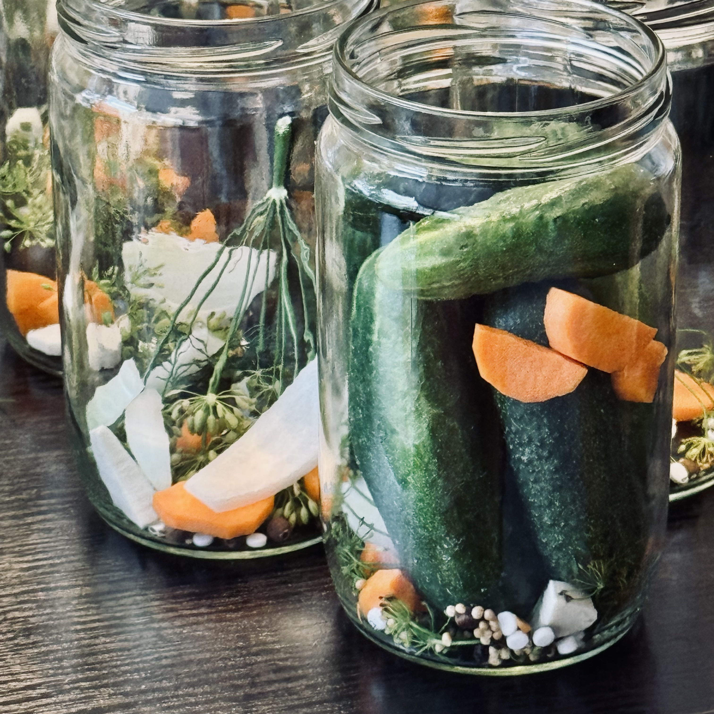
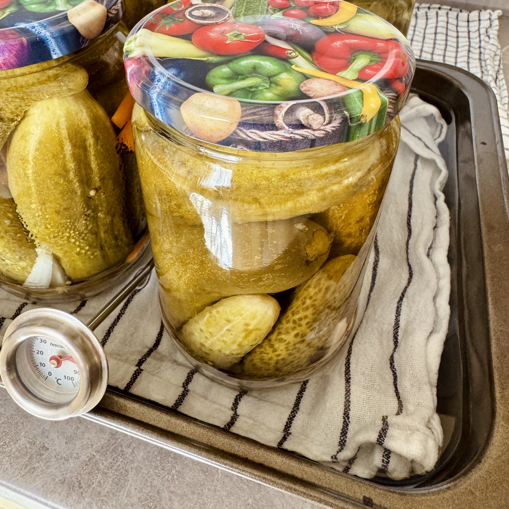
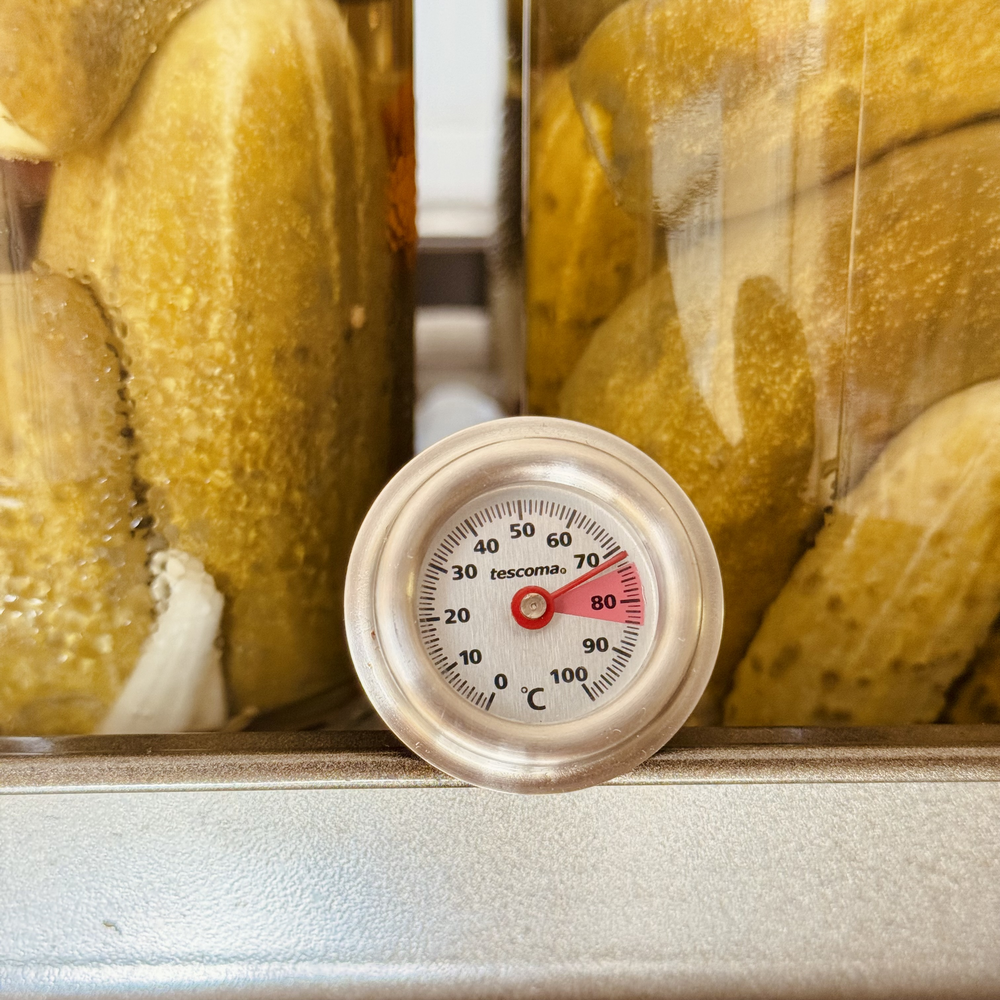

Postup vhodný pro 0,72 l sklenice (bez vaření nálevu):

- 8 tablety sacharínu
- 5 kuličky nového koření
- 5 kuliček celého pepře
- kopr (ideálně květy)
- pár koleček mrkve
- několik plátků cibule
- kousek křenu (např. 1×1 cm kostka)
- 1 mírně navršená čajová lžička soli nahoru
- 0,85 ml octa (necelý decilitr) - zbytek dolít vodou

Vodu doléváme tak, aby okurky byly ponořené a voda dosahovala cca **1.5-2 cm od okraje sklenice**.

#### Sklenice a víčka

Používáme šroubovací víčka a sklenice o objemu 0,72 l (ideálně s širokým hrdlem).

- Sklenice důkladně umýt (myčka na 70 °C nebo ručně saponátem).
- Sklenice **sterilizovat v troubě** na **150 °C** po dobu **15 minut**
- Víčka zalít horkou vodou - sterilizovat nejméně 10 minut
- Víčka musí být před nasazením **suchá**, jinak nechytnou.

**Víčka nedotahovat!!!** Jen lehce přitáhnout, víčka drží podtlakem po zavaření.

#### Zavařování

Nejlepší zkušenosti mám se zavařováním okurek v troubě:

- Troubu předehřejeme na **150 °C**.
- Hluboký plech nebo pekáč vyložíme utěrkou.
- Zalejeme předehřátou vodou (85 °C) do výšky cca 4-5 cm.
- Do vody vložíme sklenice s okurkami.

:::tip[Zavařování v troubě]
Zavařovat 30-40 minut v předehřáté troubě **150 °C**
:::

Sklenice se nesmí dotýkat, aby nepraskly. Při zavařování v troubě je **nutné hlídat teplotu**, aby nedošlo k přehřátí a
prasknutí sklenic. Ideální je dosáhnout teploty vody 80–85 °C

Sklenice vyjmeme, otočíme dnem vzhůru a necháme vychladnout. Pokud jsou dobře zavařené, **víčka se prohnou dovnitř** a
sklenice drží podtlak.

:::tip[Zavařování v hrnci]
Zavařovat 20-25 minut při teplotě **80–85 °C**
:::

💡 Na 10 kg okurek potřebujete přibližně **30 sklenic (0,72l)**