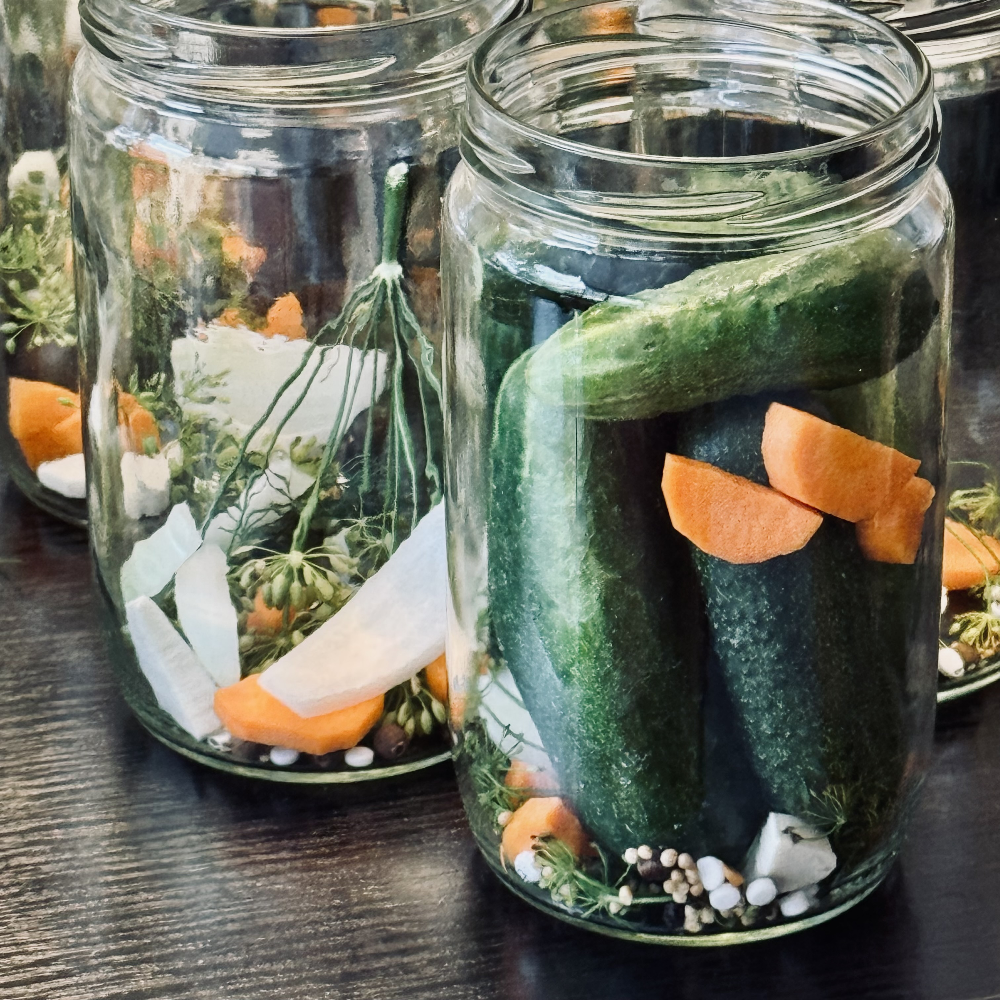
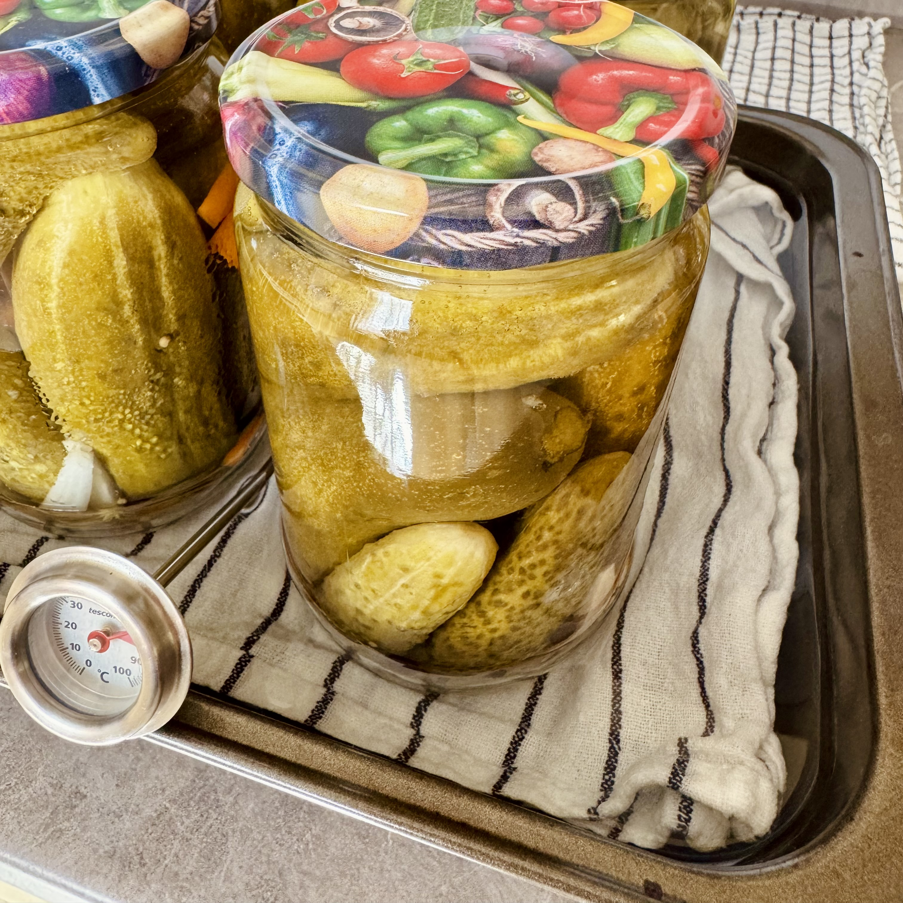
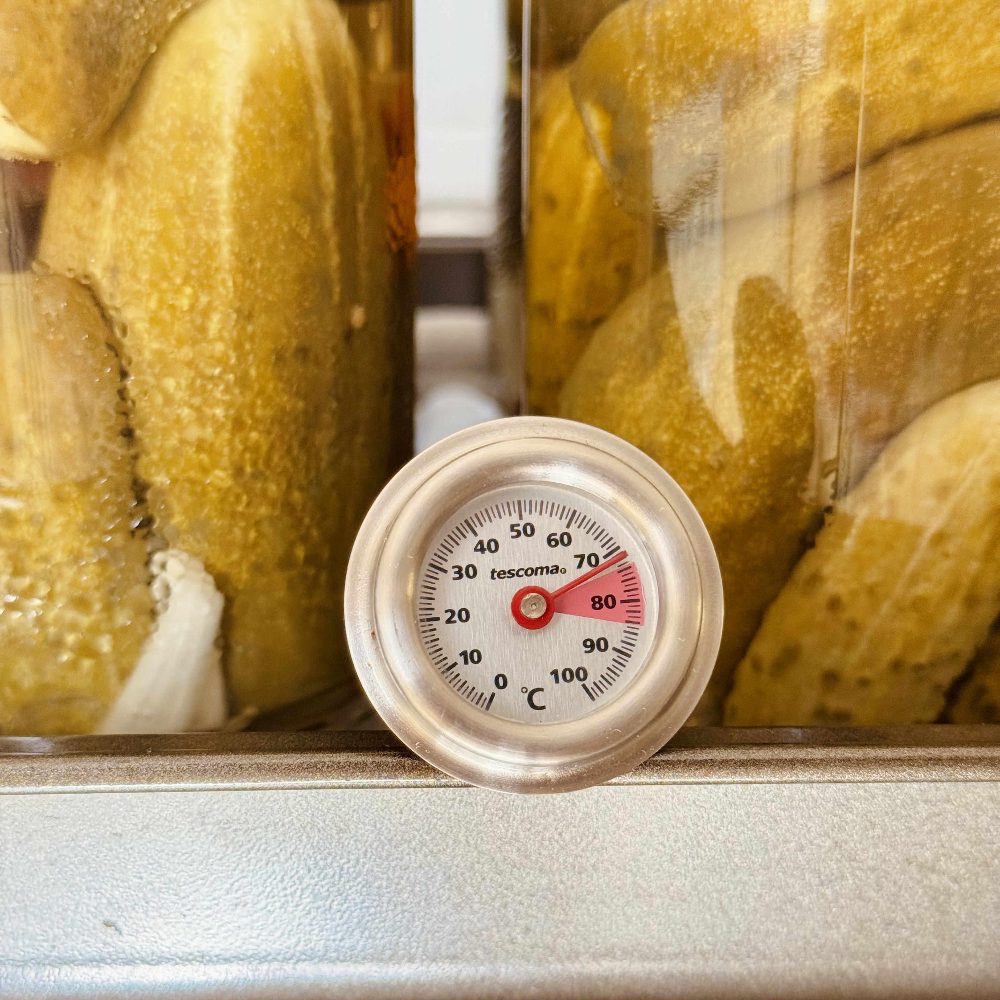

Postup vhodný pro 0,72 l sklenice (bez vaření nálevu):

- 8 tablety sacharínu
- 5 kuličky nového koření
- 5 kuliček celého pepře
- kopr (ideálně květy)
- pár koleček mrkve
- několik plátků cibule
- kousek křenu (např. 1×1 cm kostka)
- 1 mírně navršenou čajovou lžičku soli (nahoru na okurky)
- 85 ml octa (8%) – zbytek dolít vodou

Vodu doléváme tak, aby byly okurky **zcela ponořené** a hladina sahala cca **1,5–2 cm pod okraj sklenice**. 
Tento prostor je důležitý pro vytvoření podtlaku při chladnutí pro bezpečné zavaření.

💡 Na 10 kg okurek potřebujete přibližně **30 sklenic (0,72l)**

#### Sklenice a víčka

Používáme šroubovací sklenice o objemu 0,72 l se širokým hrdlem.

- Sklenice důkladně umýt (myčka na 70 °C nebo ručně saponátem).
- Sklenice **sterilizovat v troubě** na **150 °C** po dobu **15 minut**
- Víčka zalít horkou vodou - sterilizovat nejméně 10 minut
- Víčka musí být před nasazením **suchá**, jinak nechytnou.

**Víčka nedotahovat silou!** Utáhni je jen lehce – tzv. „na doraz“ prsty.
Víčka musí být utažená tak, aby mohl při zavařování unikat vzduch.
Po vychladnutí se díky podtlaku víčka přichytí pevně k hrdlu sklenice.

#### Zavařování v troubě

Nejlepší zkušenosti mám se zavařováním okurek v troubě:

1. Troubu předehřejeme na **150 °C** (horní + dolní ohřev, **bez ventilátoru**). 
2. Do hlubokého plechu/pekáče vložíme složenou utěrku.
3. Nalijeme **horkou vodu (cca 85 °C)** do výšky **4–5 cm**.
4. Vložíme sklenice s okurkami tak, aby se nedotýkaly.
5. Zavařujeme **30–40 minut**. 
 
Při zavařování v troubě je **nutné hlídat teplotu** Ideální je dosáhnout teploty vody 80–85 °C - ve vodě a 
sklenicích se musí dělat **jen malé bublinky**, nesmí vřít. Po zavaření ihned vyndej a **otoč dnem vzhůru na cca 5 minut**.

:::tip[Zavařování v troubě]
Zavařovat **30–40 minut** při **150 °C** v předehřáté troubě.
:::

Po vychladnutí:
- Víčka se musí **prohnout dovnitř** (podtlak).
- Pokud víčko při stisku "kliká", sklenice nechytla – lze znovu přezavařit s novým víčkem, nebo co nejdříve spotřebovat.

#### Zavařování v hrnci

- Sklenice postav do hrnce s vodou tak, aby byly ponořené do 3/4 výšky.
- Zahřej na 85–90 °C a drž tuto teplotu cca 25–30 minut.

:::tip[Zavařování v hrnci]
Zavařovat 20-25 minut při teplotě **85–90 °C**
:::

## Další tipy

- Nepoužívej opakovaně víčka, pokud jsou zkřivená nebo poškozená.
- Nejlépe chytají víčka [Orion Bio se zeleninou](https://www.oriondomacipotreby.cz/zavarovaci-vicko-bio-82-10-ks-151332)
