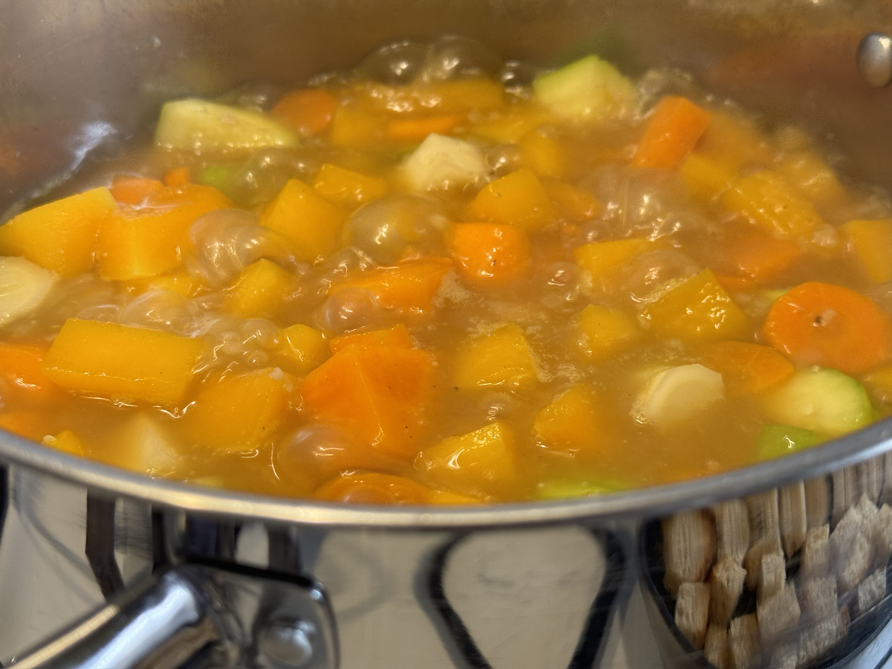
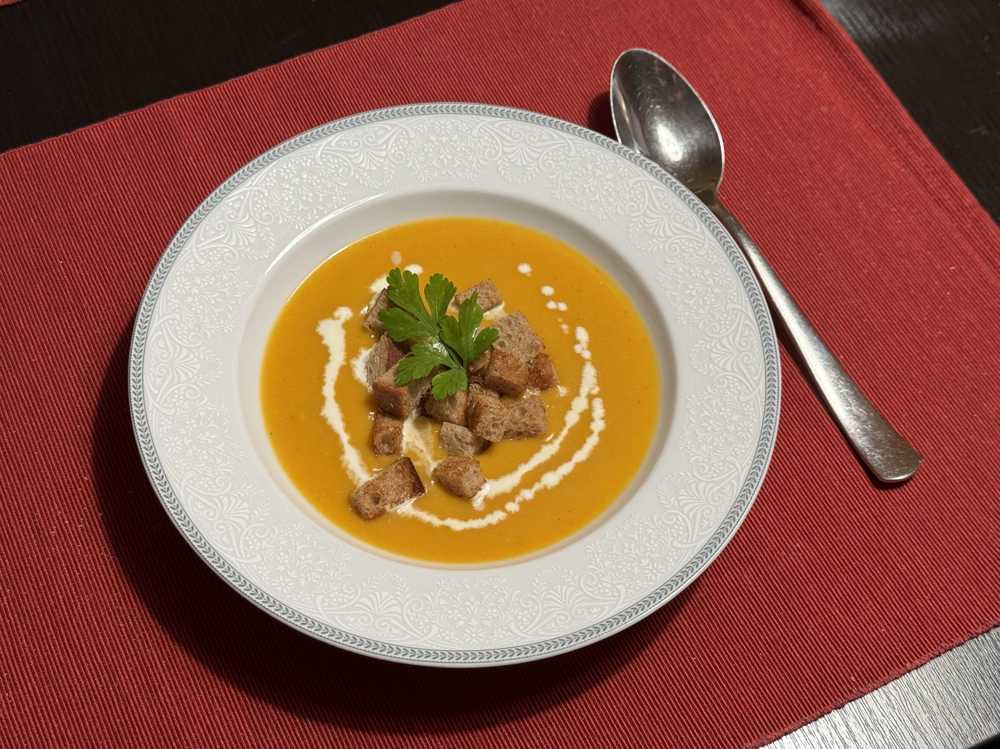

#### Ingredience

* cca 1 kg dýně (ideálně máslová nebo hokaido)
* 1 cibule
* 1 stroužek česneku
* 2 mrkev
* cca třetinu celeru
* 2 petržel
* 1 lžíce olivového oleje
* 1 lžíce másla
* smetana
* drcený kmín
* mletý pepř
* sůl

Oloupeme si mrkev, celer, petržel a dýni a nakrájíme na kostičky
Na rozpuštěném másle orestujeme oloupanou cibuli nakrájenou na kostičky.
Až cibule zezlátne, přidáme prolisovaný česnek.

Poté přidáme nakrájenou zeleninu a dýni. Zalijeme vodou a vaříme do měkka.

Vše rozmixujeme a přidáme smetanu, kmín, sůl a pepř dle chuti a ještě krátce povaříme.
Případně můžeme ještě znovu promixovat, aby byla polévka opravdu krémová.
Pro zjemnění chuti můžeme přidat ještě trochu másla a smetanu.

