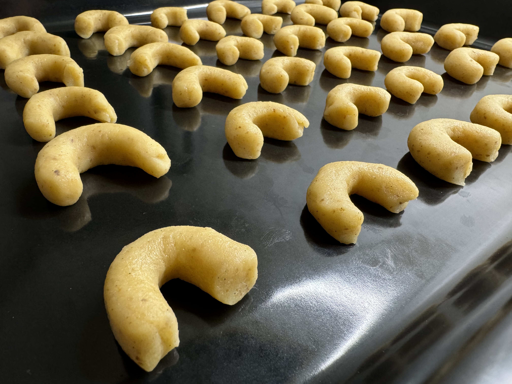
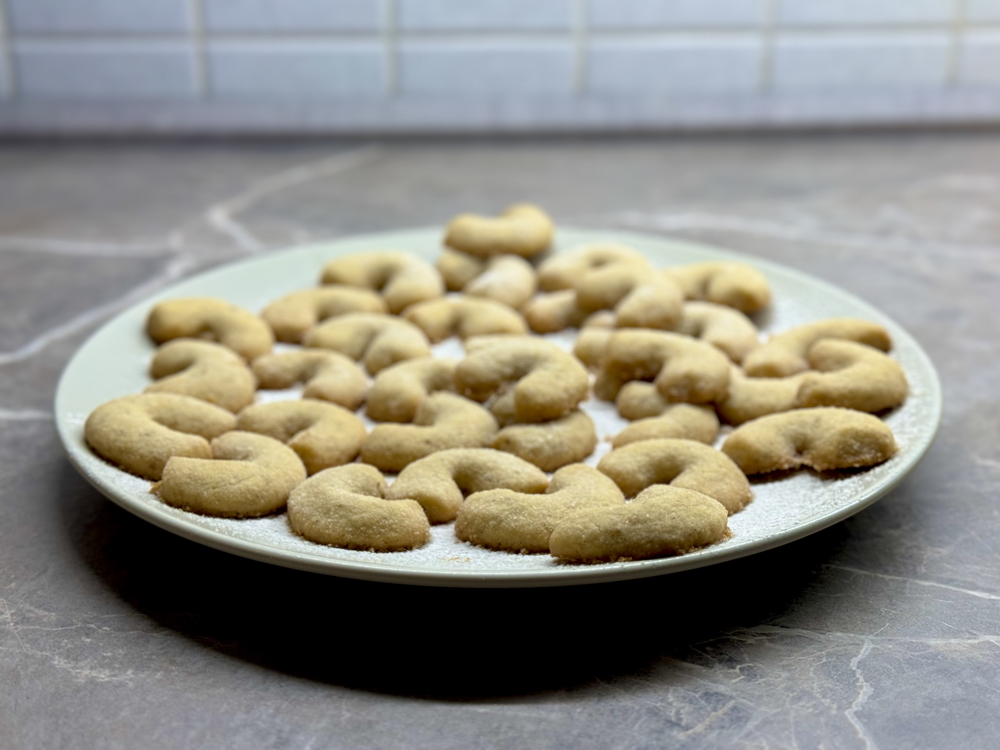
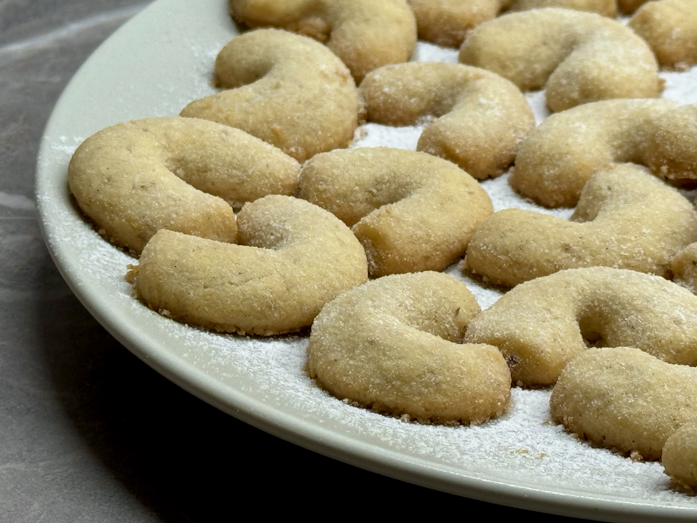

* 250 g másla
* 350 g hladké mouky
* 110 g moučkového cukru
* 120-150 g nastrouhaných vlašských ořechů
* vanilkový lusk
* dva žloutky
* sůl (cca 1g)
* trocha citrónové kůry

Smícháme hladkou kouku a curk a vše 2x přesejeme přes cedník.
Přidáme změklé máslo, dva žloutky, vanilku a jemně nastrouhané ořechy.
Osolíme a přidáme trochu citrónové kůry. Zpracujeme vláční těsto,
hotové těsto zabalíme do potravinové folie a
necháme v lednici odležet do ruhého dne.

Hotové těsto musí být po celou dobu studené, vždy odkrojte kousek, se kterým budete pracovat.
Vytvarujte cca 1 cm širokého hada a rozkrájejte jej na 5cm dlouhé kousky.
Vytvarujte malé rohlíčky, ty pokládajte na pečící papír nebo přímo na plech vedle sebe.

Pečeme v mírně **vyhřáté troubě na 150°C** do růžova **10 až 15 minut**.

Ihned po upečení jsou rohlíčky velmi křehké a musí se nechat chvíli vychladnout.
Poté se ještě teplé rohlíčky obalují v moučkovém cukru. Rozležení alespoň 14 dní.

